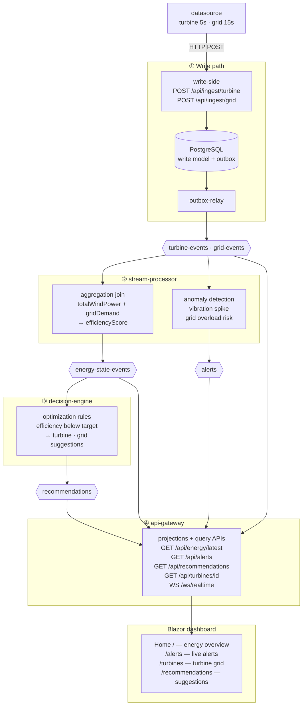
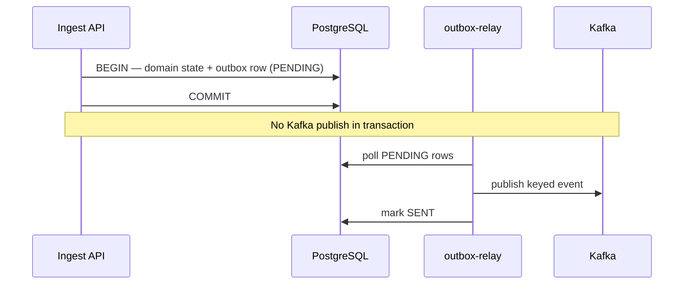
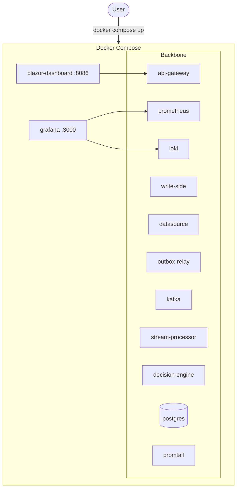

# AetherStream

An end-to-end demo of real-time event processing, using wind-energy monitoring as the
scenario. The same lifecycle—ingest, reliable publish, stream processing, read models,
alerts, and a live dashboard—shows up in industrial IoT, manufacturing telemetry, logistics
tracking, and similar domains where sensors produce continuous data that must be acted on
quickly.

The stack covers Kafka, CQRS, the outbox pattern, Flink stream processing, a Blazor
dashboard, and observability. Docker is the only prerequisite to run it locally.

See [HANDOFF.md](HANDOFF.md) for build-from-source and contributor notes.

## What it demonstrates

This is a working reference implementation, not a production deployment. It walks through
the full path from simulated sensor feeds to operator-facing updates:

- **Ingestion and reliability** — telemetry arrives via HTTP; the outbox pattern publishes
  to Kafka in the same transaction as persistence (no dual-write)
- **Event-driven backbone** — producers decoupled from processing on Kafka topics
- **CQRS** — write model (commands, outbox) vs read model (query APIs, projections)
- **Stream processing** — aggregation joins, anomaly detection, rule-based recommendations
- **Real-time UI** — Blazor + Radzen over REST and WebSocket
- **Observability** — Grafana, Loki, Promtail, Prometheus

The wind-turbine domain is illustrative. The patterns transfer to any setting where
multiple event streams must be joined, monitored, and surfaced in near real time.

Design docs: [spec.md](specs/001-aetherstream/spec.md),
[architecture.md](specs/001-aetherstream/architecture.md).

## Architecture

### End-to-end data flow

Simulated feeds POST to the write side; the outbox relay publishes to Kafka; Flink jobs
process streams; the API gateway serves queries and pushes live updates to the UI.



Stages **①–④** run top to bottom. **stream-processor** splits into aggregation (energy state)
and anomaly (alerts) branches; **decision-engine** consumes energy state and emits recommendations.
The gateway projects all topic families, serves the REST paths above, and pushes live events over
WebSocket to the four UI pages.

### Outbox transaction (reliability core)

Kafka is never called inside the business transaction — the relay drains `outbox_events` afterward.



### Local deployment

The full stack runs in Docker Compose. Blazor and Grafana are exposed on host ports; all
other services communicate on the Compose network. PostgreSQL runs as a container alongside
the application services.



## Try it locally

**Prerequisite:** Docker Desktop (or Docker Engine + Compose).

```powershell
docker compose -f infra/docker-compose.yml up -d --build
```

First run builds images (several minutes); later runs use the cache. Health check:
`docker compose -f infra/docker-compose.yml ps -a`

### What to open

| What | URL |
|------|-----|
| **Blazor dashboard** (start here) | http://localhost:8086 |
| Grafana (logs + metrics) | http://localhost:3000 (`admin` / `admin`) |
| Flink Web UI | http://localhost:8088 |
| Kafka UI | http://localhost:8089 |
| API — latest energy state | http://localhost:8085/api/energy/latest |
| API — alerts | http://localhost:8085/api/alerts |
| API — recommendations | http://localhost:8085/api/recommendations |

Live updates use WebSocket `ws://localhost:8085/ws/realtime` (the dashboard connects automatically).

The **datasource** simulator feeds the pipeline continuously — within a minute you should see
energy cards, alerts, and recommendations update without refreshing the Blazor UI.

### Observability quick links

Pre-built dashboard: **Dashboards → AetherStream → AetherStream Logs**.

| What you'll see | Link |
|-----------------|------|
| Datasource simulator (logs every 5–15s) | [Grafana → Loki](http://localhost:3000/explore?orgId=1&schemaVersion=1&panes=%7B%22ds%22%3A%7B%22datasource%22%3A%22loki%22%2C%22range%22%3A%7B%22to%22%3A%22now%22%2C%22from%22%3A%22now-15m%22%7D%2C%22queries%22%3A%5B%7B%22datasource%22%3A%7B%22uid%22%3A%22loki%22%2C%22type%22%3A%22loki%22%7D%2C%22expr%22%3A%22%7Bcontainer%3D%5C%22aether-datasource%5C%22%7D%22%2C%22refId%22%3A%22A%22%7D%5D%7D%7D) |
| Write-side ingest + `correlationId` | [Grafana → Loki](http://localhost:3000/explore?orgId=1&schemaVersion=1&panes=%7B%22ws%22%3A%7B%22datasource%22%3A%22loki%22%2C%22range%22%3A%7B%22to%22%3A%22now%22%2C%22from%22%3A%22now-15m%22%7D%2C%22queries%22%3A%5B%7B%22datasource%22%3A%7B%22uid%22%3A%22loki%22%2C%22type%22%3A%22loki%22%7D%2C%22expr%22%3A%22%7Bcontainer%3D%5C%22aether-write-side%5C%22%7D%20%7C%20json%20%7C%20correlationId%20!%3D%20%5C%22%5C%22%22%2C%22refId%22%3A%22A%22%7D%5D%7D%7D) |
| HTTP request rate (Spring services) | [Grafana → Prometheus](http://localhost:3000/explore?orgId=1&schemaVersion=1&panes=%7B%22pm%22%3A%7B%22datasource%22%3A%22prometheus%22%2C%22range%22%3A%7B%22to%22%3A%22now%22%2C%22from%22%3A%22now-15m%22%7D%2C%22queries%22%3A%5B%7B%22datasource%22%3A%7B%22uid%22%3A%22prometheus%22%2C%22type%22%3A%22prometheus%22%7D%2C%22expr%22%3A%22rate(http_server_requests_seconds_count%7Bjob%3D%5C%22spring-services%5C%22%7D%5B1m%5D)%22%2C%22refId%22%3A%22A%22%7D%5D%7D%7D) |

## Documentation

| Document | Description |
|----------|-------------|
| [HANDOFF.md](HANDOFF.md) | Build from source, ops notes |
| [specs/001-aetherstream/spec.md](specs/001-aetherstream/spec.md) | Functional requirements |
| [specs/001-aetherstream/architecture.md](specs/001-aetherstream/architecture.md) | Technical design |

## License

Use and modify at your own discretion. No warranty implied.
