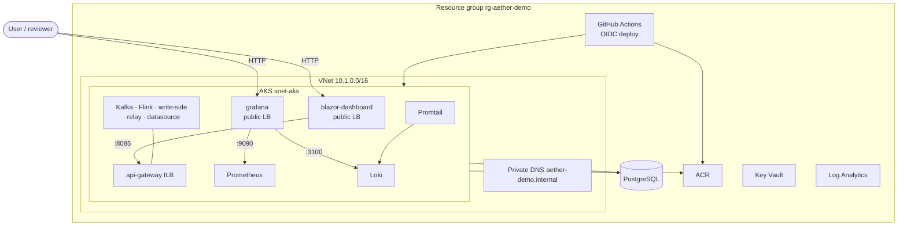

# AetherStream Azure Infrastructure (Terraform)

Single-VNet demo: **AKS** hosts the full stack — streaming backbone **and** public UI
(Blazor + Grafana via LoadBalancer Services). GitHub Actions CD via OIDC.

## Omitted for price consideration

- Application Gateway and WAF
- Private endpoints (PostgreSQL, ACR, Key Vault)
- Hub-spoke VNet peering
- Premium ACR / private-link registry
- Multi-node AKS and zone redundancy
- App Service or standalone VMs for UI and Grafana — **Blazor and Grafana run in the AKS cluster** (public LoadBalancer Services) instead

## Architecture

Canonical Azure diagram (also linked from the repo [README](../../README.md#azure-deployment)):



Blazor and Grafana are deployed **inside the AKS cluster** (public LoadBalancer Services), not on
App Service or separate VMs — a cost-driven placement choice.

**Traffic flow**

1. User opens Blazor / Grafana on public LoadBalancer IPs (URLs in the **motivation letter**).
2. Blazor calls `http://api-gateway:8085` in-cluster.
3. Grafana reads Prometheus at `http://prometheus:9090` and Loki at `http://loki:3100` in-cluster.
4. Promtail (DaemonSet) ships pod stdout from the `aether` namespace to Loki.
5. GitHub Actions (OIDC) builds images → ACR, deploys all manifests to AKS.

## Layout

```text
infra/terraform/
  bootstrap/              # One-time: remote state + GitHub OIDC app registration
  environments/demo/      # Demo environment root module
  modules/
    networking/           # VNet, AKS subnet, internal private DNS
    security/             # Key Vault, generated secrets
    data/                 # PostgreSQL, ACR, Log Analytics
    compute-aks/          # AKS cluster
    observability/        # Diagnostic settings → Log Analytics
```

UI and observability manifests live in `infra/k8s/base/` (`blazor-dashboard`, `grafana`,
`loki`, `promtail`, `prometheus`).

## Prerequisites

- Azure subscription with **Compute** quota for AKS (1 node)
- [Terraform](https://www.terraform.io/downloads) >= 1.6
- [Azure CLI](https://learn.microsoft.com/cli/azure/install-azure-cli) logged in (`az login`)
- [kubectl](https://kubernetes.io/docs/tasks/tools/) + AKS credentials
- GitHub repository with Environments enabled (`demo`)

Register providers (once per subscription):

```powershell
az provider register --namespace Microsoft.ContainerService
az provider register --namespace Microsoft.Network
az provider register --namespace Microsoft.DBforPostgreSQL
az provider register --namespace Microsoft.KeyVault
```

## Step 1 — Bootstrap (manual, once)

```powershell
cd infra/terraform/bootstrap
cp terraform.tfvars.example terraform.tfvars
terraform init
terraform apply
```

Record outputs → GitHub secrets `AZURE_CLIENT_ID`, `AZURE_TENANT_ID`, `AZURE_SUBSCRIPTION_ID`.

## Step 2 — Deploy demo environment

```powershell
cd infra/terraform/environments/demo
terraform init
terraform plan
terraform apply
```

## Step 3 — Deploy workloads (including UI)

```powershell
az aks get-credentials --resource-group rg-aether-demo --name aether-demo-aks
$kv = terraform output -raw key_vault_name
$pgHost = terraform output -raw postgres_fqdn
$pgDb = terraform output -raw postgres_database_name
$pgPass = az keyvault secret show --vault-name $kv --name postgres-admin-password --query value -o tsv
$grafPass = az keyvault secret show --vault-name $kv --name grafana-admin-password --query value -o tsv
kubectl create namespace aether --dry-run=client -o yaml | kubectl apply -f -
kubectl apply -k infra/k8s/overlays/demo
kubectl -n aether create secret generic aether-secrets `
  --from-literal=AETHER_DB_URL="jdbc:postgresql://${pgHost}:5432/${pgDb}" `
  --from-literal=AETHER_DB_PASSWORD="$pgPass" `
  --dry-run=client -o yaml | kubectl apply -f -
kubectl -n aether create secret generic grafana-secrets `
  --from-literal=GF_SECURITY_ADMIN_PASSWORD="$grafPass" `
  --dry-run=client -o yaml | kubectl apply -f -
```

Public Blazor and Grafana URLs are recorded in the **motivation letter** for reviewers — not in this repository.

## Public vs private exposure

| Surface | Access |
|---|---|
| Blazor + Grafana (AKS LoadBalancers) | Public HTTP — URLs in the **motivation letter** |
| api-gateway, write-side, Kafka, Flink | AKS internal / ILB only |
| PostgreSQL, ACR, Key Vault | Public endpoints |

## CD pipelines

- `.github/workflows/infra-cd.yml` — Terraform plan on PR, apply on `main`
- `.github/workflows/app-cd.yml` — Build/push images, deploy all AKS workloads

Both use GitHub OIDC; no long-lived Azure client secrets in the repo.

## Smoke verification

See [SMOKE-VERIFY.md](SMOKE-VERIFY.md).

## Rollback

```powershell
cd infra/terraform/environments/demo
terraform destroy
```

Bootstrap state storage is retained unless you explicitly destroy `bootstrap/`.
