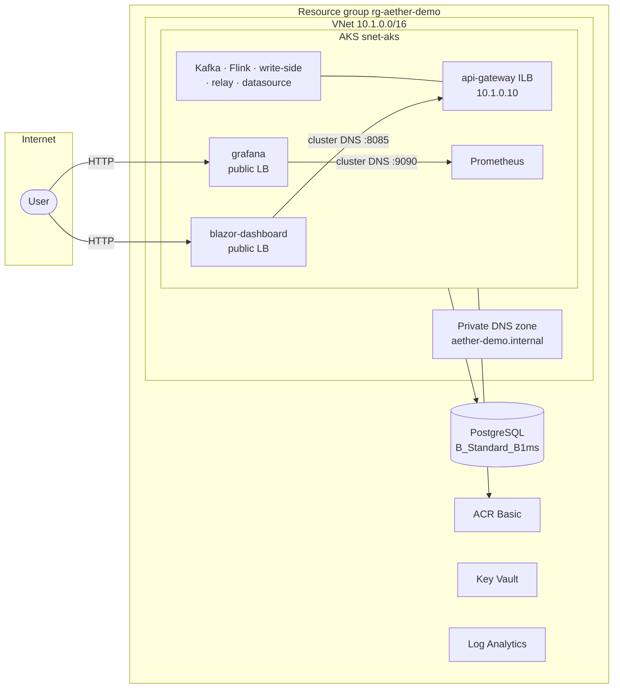

# AetherStream Azure Infrastructure (Terraform)

Single-VNet demo: **AKS** hosts the full stack — streaming backbone **and** public UI
(Blazor + Grafana via LoadBalancer Services). Lowest viable SKUs throughout. GitHub Actions CD via OIDC.

## Deliberately omitted for cost

The following are **not deployed** in this demo stack. They were cut to keep monthly spend near
**~$85/mo** and to avoid always-on edge infrastructure:

| Not deployed | Rationale |
|---|---|
| **Application Gateway** | ~$200/mo fixed — largest cost; AKS public LoadBalancers are the front door instead |
| **WAF (Web Application Firewall)** | Tied to Application Gateway WAF_v2; no OWASP/rule-set filtering in demo |
| **Private endpoints** (UI, DB, registry, vault) | ~$7/mo each; public endpoints + RBAC/managed identity instead |
| **Hub-spoke networking** | Extra VNet, peering, and DNS complexity without benefit at demo scale |
| **Premium SKU tiers** (ACR Premium) | Required only for private-link designs |
| **App Service** | B1 Web quota unavailable (0) in North Europe on this subscription |
| **Linux VM for UI** | Removed earlier; UI runs on AKS |

**Privacy note:** Blazor and Grafana are on **public AKS LoadBalancer IPs** (HTTP).
Streaming backends remain on internal AKS LoadBalancers (api-gateway ILB, Prometheus ILB) — not
Internet-routable. PostgreSQL, ACR, and Key Vault use **public network paths** with Azure defaults;
treat secrets and data as demo-only.

Reintroduce Application Gateway, WAF, private endpoints, and hub-spoke isolation for production.

## Architecture



**Traffic flow**

1. User opens Blazor / Grafana on public LoadBalancer IPs (`kubectl get svc -n aether`).
2. Blazor calls `http://api-gateway:8085` in-cluster.
3. Grafana reads Prometheus at `http://prometheus:9090` in-cluster.
4. GitHub Actions (OIDC) builds images → ACR, deploys all manifests to AKS.

## Layout

```text
infra/terraform/
  bootstrap/              # One-time: remote state + GitHub OIDC app registration
  environments/demo/      # Demo environment root module
  modules/
    networking/           # VNet, AKS subnet, internal private DNS
    security/             # Key Vault, generated secrets
    data/                 # PostgreSQL, ACR, Log Analytics
    compute-aks/          # AKS cluster
    observability/        # Diagnostic settings → Log Analytics
```

UI manifests live in `infra/k8s/base/blazor-dashboard/` and `infra/k8s/base/grafana/`.

## Prerequisites

- Azure subscription with **Compute** quota for AKS (1 node)
- [Terraform](https://www.terraform.io/downloads) >= 1.6
- [Azure CLI](https://learn.microsoft.com/cli/azure/install-azure-cli) logged in (`az login`)
- [kubectl](https://kubernetes.io/docs/tasks/tools/) + AKS credentials
- GitHub repository with Environments enabled (`demo`)

Register providers (once per subscription):

```powershell
az provider register --namespace Microsoft.ContainerService
az provider register --namespace Microsoft.Network
az provider register --namespace Microsoft.DBforPostgreSQL
az provider register --namespace Microsoft.KeyVault
```

## Step 1 — Bootstrap (manual, once)

```powershell
cd infra/terraform/bootstrap
cp terraform.tfvars.example terraform.tfvars
terraform init
terraform apply
```

Record outputs → GitHub secrets `AZURE_CLIENT_ID`, `AZURE_TENANT_ID`, `AZURE_SUBSCRIPTION_ID`.

## Step 2 — Deploy demo environment

```powershell
cd infra/terraform/environments/demo
terraform init
terraform plan
terraform apply
```

## Step 3 — Deploy workloads (including UI)

```powershell
az aks get-credentials --resource-group rg-aether-demo --name aether-demo-aks
$pgPass = az keyvault secret show --vault-name aether4adcdemokv --name postgres-admin-password --query value -o tsv
$grafPass = az keyvault secret show --vault-name aether4adcdemokv --name grafana-admin-password --query value -o tsv
kubectl create namespace aether --dry-run=client -o yaml | kubectl apply -f -
kubectl apply -k infra/k8s/overlays/demo
kubectl -n aether create secret generic aether-secrets `
  --from-literal=AETHER_DB_URL="jdbc:postgresql://aether-demo-pg.postgres.database.azure.com:5432/aetherstream" `
  --from-literal=AETHER_DB_PASSWORD="$pgPass" `
  --dry-run=client -o yaml | kubectl apply -f -
kubectl -n aether create secret generic grafana-secrets `
  --from-literal=GF_SECURITY_ADMIN_PASSWORD="$grafPass" `
  --dry-run=client -o yaml | kubectl apply -f -
kubectl get svc blazor-dashboard grafana -n aether
```

## Public vs private exposure

| Surface | Access |
|---|---|
| Blazor + Grafana (AKS LoadBalancers) | Public HTTP — `kubectl get svc -n aether` |
| api-gateway, write-side, Kafka, Flink | AKS internal / ILB only |
| PostgreSQL, ACR, Key Vault | Public endpoints (demo cost model) |

## CD pipelines

- `.github/workflows/infra-cd.yml` — Terraform plan on PR, apply on `main`
- `.github/workflows/app-cd.yml` — Build/push images, deploy all AKS workloads

Both use GitHub OIDC; no long-lived Azure client secrets in the repo.

## Smoke verification

See [SMOKE-VERIFY.md](SMOKE-VERIFY.md).

## Cost notes

See [COST-ESTIMATE.md](COST-ESTIMATE.md). Application Gateway and WAF alone would add ~$200/mo;
two public LoadBalancers for UI add ~$36/mo vs App Service B1 (~$13/mo) which was unavailable on quota.

## Rollback

```powershell
cd infra/terraform/environments/demo
terraform destroy
```

Bootstrap state storage is retained unless you explicitly destroy `bootstrap/`.
