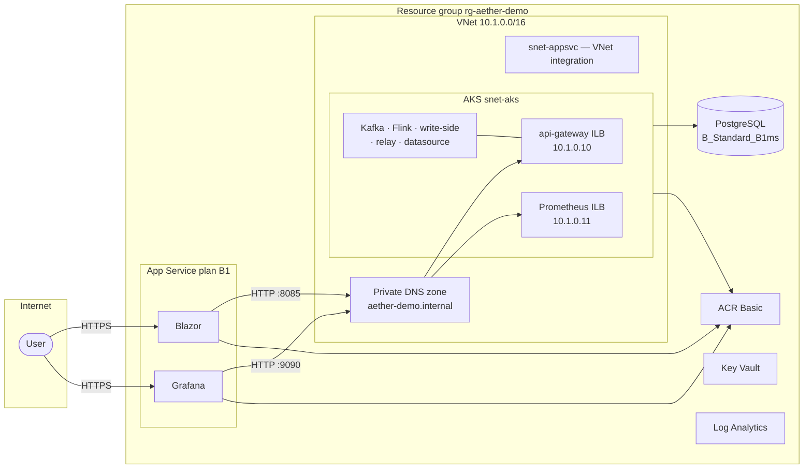

# AetherStream Azure Infrastructure (Terraform)

Single-VNet demo: **public App Service** (Blazor + Grafana) in front, **AKS** for the streaming
backbone, lowest viable SKUs throughout. GitHub Actions CD via OIDC.

## Deliberately omitted (cost & privacy)

The following **application security and edge features are not deployed** in this demo stack.
They were cut to keep monthly spend near **~$67** (Infracost) and to avoid locking the portfolio
subscription into always-on edge infrastructure:

| Not deployed | Rationale |
|---|---|
| **Application Gateway** | Largest fixed cost (~$200/mo); replaced by direct App Service HTTPS |
| **WAF (Web Application Firewall)** | Tied to AGW WAF_v2; no OWASP/rule-set filtering in demo |
| **Private endpoints** (UI, DB, registry, vault) | ~$7/mo each; public endpoints + RBAC/managed identity instead |
| **Hub-spoke networking** | Extra VNet, peering, and DNS complexity without benefit at demo scale |
| **Premium SKU tiers** (ACR Premium, App Service P1v3) | Required for private-link designs; Basic/B1 used instead |

**Privacy note:** UIs are public `*.azurewebsites.net` endpoints. Streaming backends remain on
internal AKS LoadBalancers (api-gateway ILB, Prometheus ILB) — not Internet-routable. PostgreSQL,
ACR, and Key Vault use **public network paths** with Azure service defaults; treat secrets and
data as demo-only.

Reintroduce AGW, WAF, private endpoints, and hub-spoke isolation for a production posture.

## Architecture



**Traffic flow**

1. User opens Blazor / Grafana on public App Service URLs (`dashboard_url`, `ops_url` outputs).
2. Blazor server-side calls `http://api-gateway.aether-demo.internal:8085` over **VNet integration**.
3. Grafana reads Prometheus at `http://prometheus.aether-demo.internal:9090` the same way.
4. GitHub Actions (OIDC) builds images → ACR, deploys K8s manifests to AKS, restarts App Services.

## Layout

```text
infra/terraform/
  bootstrap/              # One-time: remote state + GitHub OIDC app registration
  environments/demo/    # Demo environment root module
  modules/
    networking/         # VNet, subnets, internal private DNS
    security/           # Key Vault, managed identities, generated secrets
    data/                 # PostgreSQL, ACR, Log Analytics
    compute-aks/        # AKS cluster
    compute-appservice/ # Blazor + Grafana (public + VNet integration)
    observability/      # Diagnostic settings → Log Analytics
```

## Prerequisites

- Azure subscription with permissions to create resource groups, networks, AKS, App Service, PostgreSQL
- [Terraform](https://www.terraform.io/downloads) >= 1.6
- [Azure CLI](https://learn.microsoft.com/cli/azure/install-azure-cli) logged in (`az login`)
- GitHub repository with Environments enabled (`demo`)

Register providers (once per subscription):

```powershell
az provider register --namespace Microsoft.ContainerService
az provider register --namespace Microsoft.Network
az provider register --namespace Microsoft.DBforPostgreSQL
az provider register --namespace Microsoft.KeyVault
az provider register --namespace Microsoft.Web
```

## Step 1 — Bootstrap (manual, once)

```powershell
cd infra/terraform/bootstrap
cp terraform.tfvars.example terraform.tfvars
# Edit storage_account_name if the default name is taken globally

terraform init
terraform apply
```

Record outputs:

- `github_actions_client_id` → GitHub secret `AZURE_CLIENT_ID`
- `tenant_id` → `AZURE_TENANT_ID`
- `subscription_id` → `AZURE_SUBSCRIPTION_ID`
- Update `environments/demo/versions.tf` backend block if bootstrap names differ

Set GitHub repository **Variables** (after first demo apply):

| Variable | Source |
|---|---|
| `ACR_NAME` | `terraform output acr_name` |
| `AKS_NAME` | `terraform output aks_name` |
| `AKS_RG` | `terraform output resource_group_name` |
| `BLAZOR_APP_NAME` | `terraform output blazor_app_name` |
| `GRAFANA_APP_NAME` | `terraform output grafana_app_name` |

Set GitHub **Secrets**:

| Secret | Source |
|---|---|
| `AZURE_PG_HOST` | `terraform output postgres_fqdn` |
| `AZURE_PG_PASSWORD` | Key Vault `postgres-admin-password` |

## Step 2 — Deploy demo environment

```powershell
cd infra/terraform/environments/demo
terraform init
terraform plan
terraform apply
```

Note `dashboard_url` and `ops_url` outputs — public `*.azurewebsites.net` URLs, no hosts file required.

## Step 3 — Deploy workloads

After images are built and pushed (via `app-cd` workflow or manually):

```powershell
az aks get-credentials --resource-group rg-aether-demo --name aether-demo-aks
kubectl apply -k infra/k8s/overlays/demo
```

## Public vs private exposure

| Surface | Access |
|---|---|
| Blazor App Service | Public HTTPS (`dashboard_url` output) |
| Grafana App Service | Public HTTPS (`ops_url` output) |
| api-gateway, write-side, Kafka, Flink | AKS internal / ILB only |
| PostgreSQL, ACR, Key Vault | Public endpoints (demo cost model) |

Blazor reaches api-gateway over **VNet integration** using private DNS `api-gateway.aether-demo.internal:8085`.

## CD pipelines

- `.github/workflows/infra-cd.yml` — Terraform plan on PR, apply on `main`
- `.github/workflows/app-cd.yml` — Build/push images, deploy AKS + App Service

Both use GitHub OIDC (`ARM_USE_OIDC=true`); no long-lived Azure client secrets in the repo.

## Smoke verification

See [SMOKE-VERIFY.md](SMOKE-VERIFY.md).

## Cost notes

Demo defaults target the **lowest viable SKUs** (B1 App Service, B2als_v2 AKS node, Basic ACR, etc.).
See [COST-ESTIMATE.md](COST-ESTIMATE.md) — figures from **Infracost** only (~**$67/mo** priced baseline).

A subscription budget **`aetherstream-100`** alerts at **$80** and **$100** actual monthly spend.

Estimate before deploy:

```powershell
cd infra/terraform/environments/demo
infracost breakdown --path .
```

## What is GitHub OIDC? (bootstrap)

**OIDC** (OpenID Connect) lets GitHub Actions authenticate to Azure **without storing a
long-lived password or client secret** in the repository.

Bootstrap creates an **Entra ID app registration** with a **federated credential** that
trusts tokens from `token.actions.githubusercontent.com` for your repo (`asaleh-lab/AetherStream`).

When `infra-cd` or `app-cd` runs:

1. GitHub issues a short-lived OIDC token for that workflow run.
2. `azure/login@v2` exchanges it for an Azure access token.
3. Terraform / `az` act as the app registration (Contributor on the subscription).

You configure only `AZURE_CLIENT_ID`, `AZURE_TENANT_ID`, and `AZURE_SUBSCRIPTION_ID` in
GitHub secrets — no `AZURE_CLIENT_SECRET`.

## Rollback

```powershell
cd infra/terraform/environments/demo
terraform destroy
```

Bootstrap state storage is retained unless you explicitly destroy `bootstrap/`.
