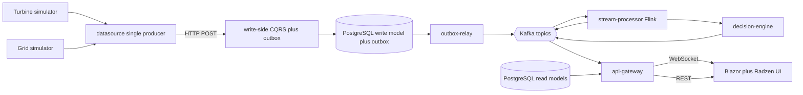
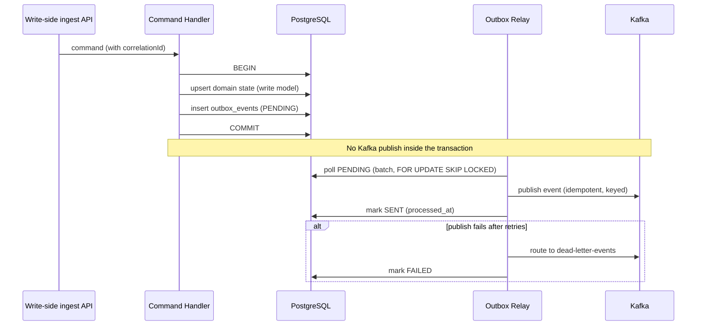

# Architecture: AetherStream

**Status**: Draft | **Created**: 2026-06-05 | **Constitution**: v1.0.0

This document defines the system architecture that realizes [spec.md](spec.md). It is the
authoritative reference for module boundaries, Kafka topics, the Outbox design, CQRS flow,
the stream-processing topology, persistence, APIs, and observability.

## 1. Technology stack

| Concern | Choice |
|---|---|
| Language / runtime | Java 21 (Corretto) |
| Application framework | Spring Boot 3.3.x |
| Stream processing | Apache Flink 1.19 (Flink-style joins/windows/keyed state) |
| Messaging | Apache Kafka (KRaft mode, single broker for local) |
| Persistence | PostgreSQL 16 + Flyway migrations |
| Build | Maven multi-module reactor + committed Maven Wrapper |
| UI | .NET 10 Blazor Server + Radzen, over REST + WebSocket |
| Logging | Logback + logstash-logback-encoder (JSON) + MDC correlation id |
| Testing | JUnit 5 + Testcontainers (Kafka, PostgreSQL) |
| Local infra | docker-compose |

ASP.NET-to-JVM mapping from the brief (documentation intent only): `BackgroundService` ->
Kafka consumer / Flink job; `MediatR` -> command/query bus; `EF Core` -> JPA/Hibernate;
`SignalR` -> WebSocket gateway; `Serilog` -> Logback JSON + MDC; `Hangfire` -> Flink jobs;
`appsettings.json` -> `application.yml`; Transactional Outbox -> outbox table + relay.

## 2. Monorepo module layout

```text
AetherStream/
  pom.xml                       # parent reactor
  services/
    write-side/                 # Spring Boot: ingest REST APIs, CQRS, domain, outbox, PostgreSQL
    datasource/                 # Thin producer: turbine + grid simulators -> POST write-side
    outbox-relay/               # Spring Boot: polls outbox_events -> Kafka, retries, DLQ
    stream-processor/           # Flink: aggregation join + anomaly detection
    decision-engine/            # Flink/consumer: optimization recommendations
    api-gateway/                # Spring Boot: query APIs + WebSocket push
  core/
    domain/                     # pure model (no framework deps)
    application/                # command/query bus, handlers, ports
    infrastructure/             # JPA, Kafka, adapters, correlation, logging
  ui/
    blazor-dashboard/           # .NET 10 Blazor Server + Radzen
  infra/
    docker-compose.yml  kafka/create-topics.sh  postgres/
  # Flyway migrations live on the infrastructure classpath:
  #   core/infrastructure/src/main/resources/db/migration/V*.sql
  specs/                        # spec-kit artifacts
  HANDOFF.md  README.md
```

Dependency direction (Clean Architecture): `domain` <- `application` <- `infrastructure` <- services.

## 3. Component & data flow



## 4. Kafka topic design

| Topic | Key | Payload (summary) | Producer | Consumers |
|---|---|---|---|---|
| `turbine-events` | turbineId | turbine telemetry | write-side (via relay) | stream-processor |
| `grid-events` | region | grid load | write-side (via relay) | stream-processor |
| `energy-state-events` | region | aggregated energy state | stream-processor | api-gateway, decision-engine |
| `alerts` | region/turbineId | alert (type, severity) | stream-processor | api-gateway |
| `dead-letter-events` | original key | failed event envelope | outbox-relay, consumers | ops/inspection |
| `outbox-events` | aggregateId | (reserved) relay/CDC channel | outbox-relay | n/a (table-driven in v1) |

Conventions: events are versioned JSON envelopes carrying `eventId`, `eventType`,
`occurredAt`, `correlationId`, and `payload`. Keys are chosen so per-entity ordering holds
within a partition. Local default: 1 partition, replication factor 1 (demo).

## 5. Outbox pattern (reliability core)

### Write-side transaction



### `outbox_events` table

| Column | Type | Notes |
|---|---|---|
| id | UUID PK | also used as `eventId` for downstream dedupe |
| aggregate_type | text | e.g. `Turbine`, `GridLoad` |
| aggregate_id | text | entity id |
| event_type | text | e.g. `TurbineTelemetryRecorded` |
| payload | jsonb | event body |
| status | text | `PENDING` \| `SENT` \| `FAILED` |
| created_at | timestamptz | default now() |
| processed_at | timestamptz | set when SENT/FAILED |

Indexes: partial index on `status = 'PENDING'` ordered by `created_at` for efficient polling.

### Relay algorithm

1. Poll a batch of `PENDING` rows oldest-first using `FOR UPDATE SKIP LOCKED` (safe for
   multiple relay instances).
2. Map `aggregate_type`/`event_type` to the destination topic; publish keyed by `aggregate_id`.
3. On success, mark `SENT` with `processed_at`. On transient failure, leave `PENDING` for
   retry with backoff; on exhausted retries, publish to `dead-letter-events` and mark `FAILED`.
4. At-least-once delivery; downstream dedupes by `eventId` (the outbox `id`).

## 6. CQRS

- **Write side**: the **`write-side`** service exposes ingest REST APIs; the thin **`datasource`**
  service POSTs simulated/polled readings. Handlers in `core/application` (via `CommandBus`)
  validate domain rules, persist write-model state where applicable, and insert outbox rows
  in the same transaction.
- **Read side**: `api-gateway` serves queries via a `QueryBus` against read-model
  projections (`energy_state_snapshot`, `alerts`, `turbine_state`) updated from Kafka.
- Buses are thin interfaces (`CommandBus`, `QueryBus`, `CommandHandler<C>`,
  `QueryHandler<Q,R>`) — the MediatR-equivalent — keeping handlers decoupled.

## 7. Stream processing topology (Flink)

- **Aggregation job** (`stream-processor`): consume `turbine-events` and
  `grid-events`; key by region; window (e.g. tumbling/sliding) and join to compute
  `totalWindPower`, `gridDemand`, `efficiencyScore`; emit `energy-state-events`.
- **Anomaly job** (`stream-processor`): keyed rules over turbine and grid streams —
  vibration-spike detection, failure patterns, grid-overload risk -> `alerts`.
- **Decision job** (`decision-engine`): consume `energy-state-events`; apply optimization
  rules; emit recommendations / balancing signals.
- Late/out-of-order data handled with event-time watermarks and allowed lateness.

## 8. Persistence (read/write separation)

- Write model: `turbine_state` (+ `outbox_events`).
- Read models: `energy_state_snapshot`, `alerts`. Updated by gateway-side consumers from
  Kafka. Schema owned by Flyway, stored on the infrastructure classpath at
  `core/infrastructure/src/main/resources/db/migration/V1__init.sql` (so every service that
  depends on `infrastructure` applies it automatically on startup).

## 9. API & real-time gateway

- Command APIs (write, on **`write-side`**): `POST /api/ingest/turbine`,
  `/api/ingest/grid`. The **`datasource`** service forwards readings to these endpoints; it
  does not expose ingest APIs itself.
- Query APIs (read, on **`api-gateway`**, Phase 5 — **DONE**): `GET /api/energy/latest`, `/api/alerts`,
  `/api/turbines/{id}`.
- WebSocket: gateway pushes energy-state updates and alerts to the Blazor UI.

## 10. Observability

- JSON logging via Logback + logstash-logback-encoder.
- Correlation id created at ingestion, stored in MDC, written to the outbox event envelope,
  propagated as a Kafka header, and restored into MDC by each consumer/stream operator.
- Spring Boot Actuator health + metrics on every Spring deployable; Flink jobs expose their
  own metrics.

## 11. Local deployment

`infra/docker-compose.yml` brings up the full backend pipeline: Kafka (KRaft), PostgreSQL 16,
Kafka UI, **`write-side`** (CQRS + outbox + DB), **`datasource`** (turbine/grid
simulators), **`outbox-relay`**, **`stream-processor`** (Flink aggregation + anomaly detection),
and **`api-gateway`** (read-model projections, query APIs, WebSocket). Add compose profile
`full` for **`blazor-dashboard`**. A one-shot `kafka-init` container applies topic creation
(`create-topics.sh`) and exits 0. Flyway runs on write-side startup.

```powershell
# Backend only
docker compose -f infra/docker-compose.yml up -d --build

# Full demo with Blazor UI
docker compose -f infra/docker-compose.yml --profile full up -d --build
```

| Service | Port | Role |
|---------|------|------|
| write-side | 8080 | Ingest APIs, CQRS, outbox, PostgreSQL |
| datasource | 8081 | External feed simulator (POSTs to write-side) |
| outbox-relay | 8084 | Outbox → Kafka relay |
| stream-processor | — | Flink job (shaded jar, `java -jar`) |
| api-gateway | 8085 | Query APIs + WebSocket push |
| blazor-dashboard | 8086 | Blazor + Radzen UI (compose profile `full`) |

**Docker build context:** `.dockerignore` excludes `ui/blazor-dashboard/bin` and `obj` but must
include `ui/blazor-dashboard/` sources for the dashboard image. Flink shaded modules
(`stream-processor`, `decision-engine`) declare `flink-connector-base` explicitly because
`flink-connector-kafka` lists it as `provided` (intended for Flink cluster classpath, not
standalone fat jars).

## 12. Phased delivery

1. **Infra & skeleton** — **DONE**: monorepo, build files, domain model, topics + schema, docker-compose, spec-kit + git + handoff.
2. **Write side + Outbox** — **DONE**: `write-side` ingest APIs, command handlers, domain persistence, transactional outbox writes; single `datasource` producer.
3. **Outbox relay** — **DONE**: idempotent batched publish, retries, DLQ.
4. **Stream processing** — **DONE**: aggregation join + anomaly detection (`stream-processor`); `decision-engine` skeleton deferred.
5. **Query side + real-time gateway** — **DONE**: read-model projections, query APIs, WebSocket push.
6. **Blazor UI live + Testcontainers tests + correlation-id propagation + metrics** — **DONE**.

## 13. Key decisions & trade-offs

- **At-least-once + idempotent consumers** instead of end-to-end Kafka exactly-once: simpler,
  robust, and the idiomatic way the Outbox pattern is taught and used.
- **Maven multi-module** over Gradle: most universally recognizable for a Java portfolio;
  Flink jobs are separate shaded modules to avoid dependency clashes with Spring Boot.
- **Blazor Server** over WASM: simplest path for high-frequency real-time push.
- **Single-node Kafka/Postgres**: demonstration scope; topology generalizes to clusters.
